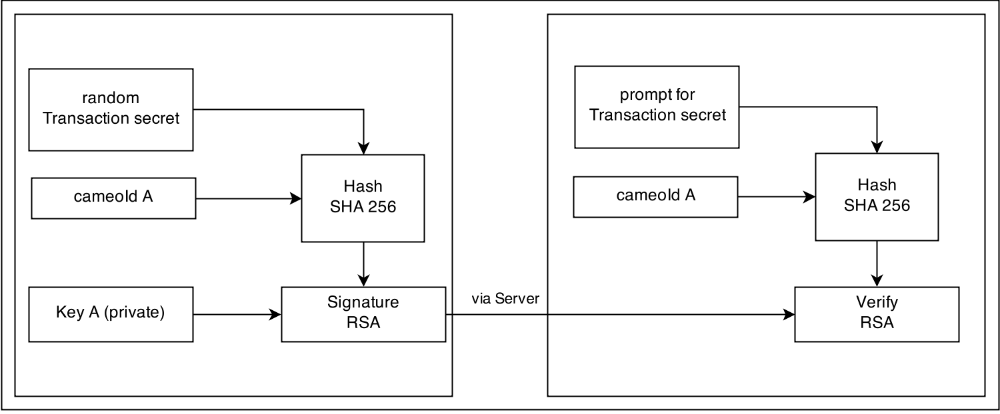

# Authentication

Key authentication is used to establish trust between two keys. This is done between multiple keys of one identity and between keys of different identities. 

The following is assumed before an authentication is started:
* The public keys have been exchanged via an insecure channel
* The cameoId of the owner of each key is known

When the authentication was successful the authenticated key will be signed. Future conversations with this key will be marked as trusted.