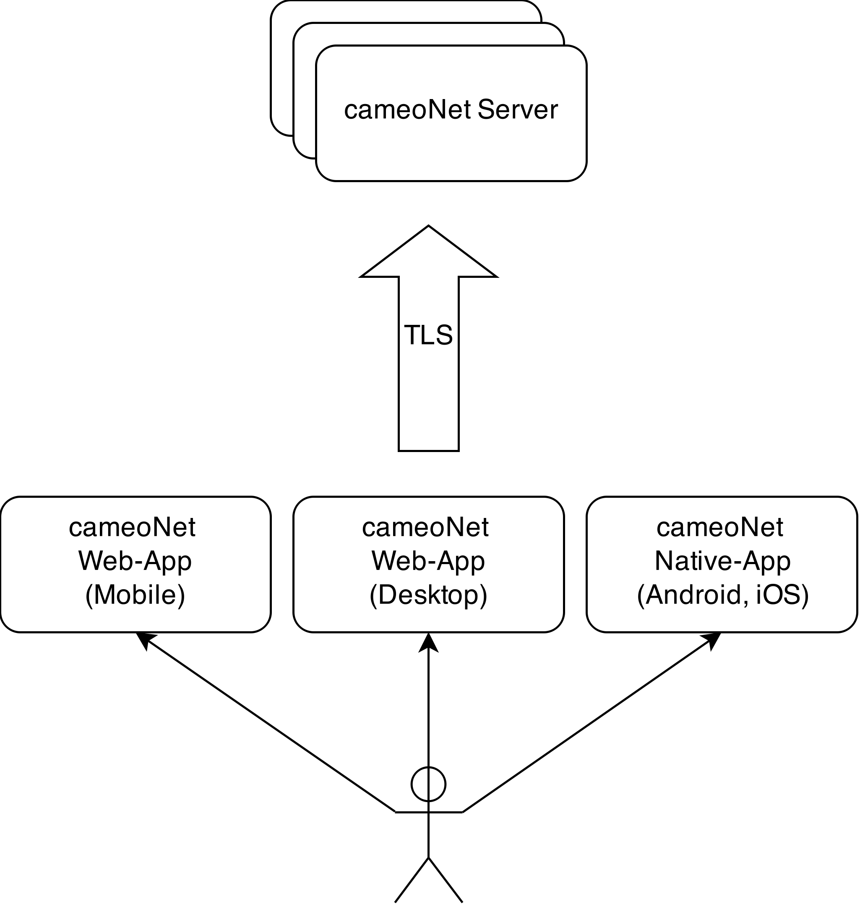
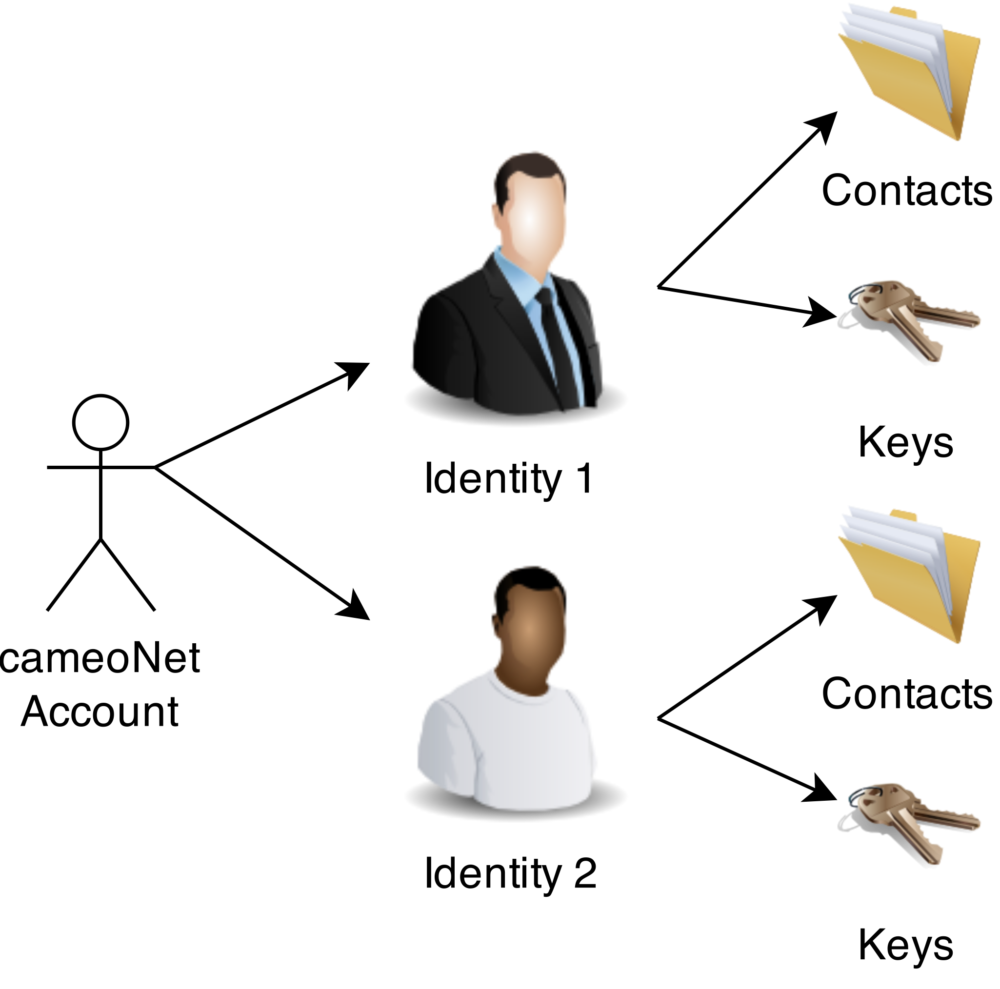
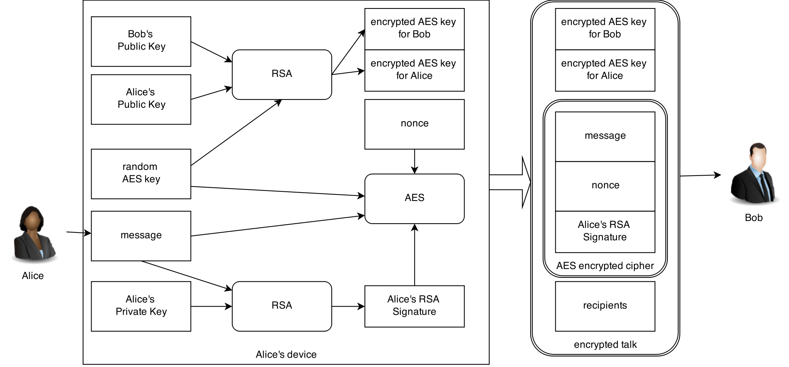
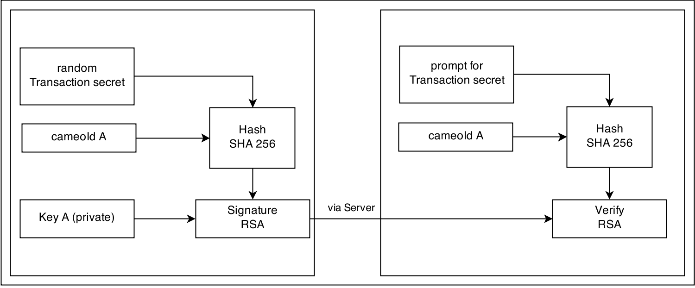

# cameoNet Security Whitepaper #

## Overview ##

cameoNet ist ein Multi-Plattform/Device/Identitäten Messenger. Mit cameoNet können Nutzer sicher vor Datenmißbrauch und ungewolltem Mitlesen von Dritten einfach kommunizieren. 
cameoNet ist offen für die leichte Einbindung von externen Kontakten (per Mail oder SMS) sondern legt auch den Quelltext vollständig 

## Implementation Details ##

### Source Code ###

Der vollständige Source Code steht bei github zur Verfügung:
https://github.com/memoConnect
Der Source Code des cameoNet Server ist in folgendem Repository zu finden:
https://github.com/memoConnect/cameoServer
Der Source Code des cameoNet Client ist in folgendem Repository zu finden:
https://github.com/memoConnect/cameoJSClient

## Transport Encryption ##

All communication between cameoNet Clients (Web and Apps) is protected by TLS. 

## Account/Identity Modell ##

### Account ###

Each user has at least one account. cameoNet does nothing to avoid that users create more than one account.
An account consists at least of a username and a password. The username mus have at least 3 characters  

### Identity ###

## Data Encryption ###

	
## Authentication ##

Key authentication is used to establish trust between two keys. This is done between multiple keys of one identity and between keys of different identities. 

The following is assumed before an authentication is started:
* The public keys have been exchanged via an insecure channel
* The cameoId of the owner of each key is known

When the authentication was successful the authenticated key will be signed. Future conversations with this key will be marked as trusted.

