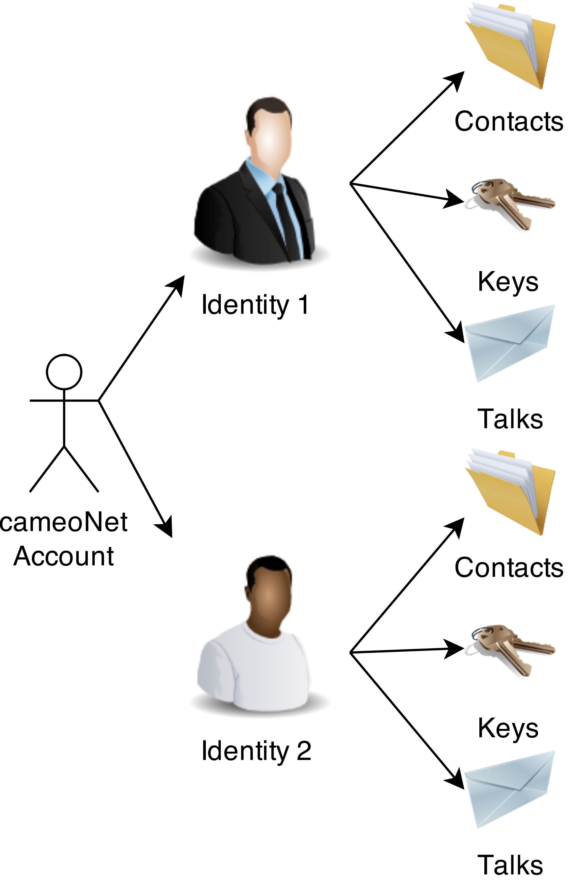

% cameoNet Security Whitepaper
% Michael Merz (dermicha@cameo.io); Björn Reimer (reimerei@cameo.io)
% 28.11.2014, DRAFT Version 0.1

# Overview

cameoNet ist ein Multi-Plattform/Device/Identitäten Messenger. Mit cameoNet können Nutzer verschlüsselt kommunizieren und sich gegen Datenmißbrauch und ungewolltem Mitlesen von Dritten schützen. 
cameoNet ist offen für die leichte Einbindung von externen Kontakten (per Mail oder SMS). 
Der cameoNet Quelltext ist vollständig veröffentlicht.

# Implementation Details

## Source Code

Der vollständige Source Code steht bei github zur Verfügung:
<https://github.com/memoConnect>

Der Source Code des cameoNet Server ist in folgendem Repository zu finden:
<https://github.com/memoConnect/cameoServer>

Der Source Code des cameoNet Client ist in folgendem Repository zu finden:
<https://github.com/memoConnect/cameoJSClient>

## Encryption Frameworks

Die gesamte Verschlüsselung erflolg auf der Client-Seite. Dazu werden foldende externe Frameworks eingesetzt:

 * [JSEncrypt](https://github.com/travist/jsencrypt), RSA Encryption, Decryption, and Key Generation 
 * [CryptoJS](https://code.google.com/p/crypto-js/), SHA256
 * [Stanford Javascript Crypto Library (SJCL)](https://crypto.stanford.edu/sjcl), AES 
 * [OpenSSL (iOS App)] (), RSA Encryption, Decryption, and Key Generation 

# Transport Encryption

Ergänzend zu der Verschlüsselung aller Nutzerdaten wird der Transportweg zwischen Client und Webserver TLS basiert verschlüsselt. Das eingesetze SSL Zertifikat ist ein "extended Validated" Zertifikat der CA COMODO. Für die Signatur des Schlüssels wurde SHA256 verwendet. 

Die TLS Konfiguration der Webserver wurde auf hohe Sicherheit und möglichst breite Browser Unterstüzung ausgerichtet. Eine Validierung wurde mit Hilfe der frei Verfügbaren Tools von [SSLLabs](https://www.ssllabs.com/ssltest/analyze.html?d=cameonet.de) und [SSLZilla](http://www.sslzilla.de/zertifikatstest.php?url=www.cameonet.de&port=443&decodedetail=Zertifikat+detailliert+pr%C3%BCfen) durchgeführt.

Zusätzlich werden denkbare Attacken auf TLS Verbidnungen durch den Einsatz von [DNSsec](https://en.wikipedia.org/wiki/Domain_Name_System_Security_Extensions) und [DANE](https://en.wikipedia.org/wiki/DNS-based_Authentication_of_Named_Entities) weiter erschwert. 

*Security disclaimer: it is planned to add certification pinning to cameoNet clients.*

# Account/Identity Modell

## Account

Each user has at least one account. cameoNet does nothing to stop users from creating more than one account.
An account consists at least of a username and a password. The username must have at least 3 characters.
A user has at least one Identity per account. The first identity will be created during registration.   

## Identity

A user contacts other users through one of his identites. Each Identity has its own contacts/keys/talk. The identities of a user are completely independent from each other. Other users can not determine which identities belongs to a certain account.

# Data Encryption

cameoNet uses AES and RSA encryption. AES is used with a key length of 256 bit. RSA keys have a length of at least  2048 bit. 

All messages and assets are encrypted using AES. A new random AES key is created for each talk. All messages and assets of a talk are encrypted with that key. 

The AES key is encrypted with the public keys of the recipients. Lets say Alice uses a smartphone and a PC and Bob uses a PC and a tablet. The AES key will be encrypted 4 times. That makes it possible for Alice and Bob to read this talk on all their devices.

## Encryption Levels 

When a user wants to send a message to an external contact cameoNet provides two alternatives to encrypt the content. In both cases all content is encrypted using AES256. The two alternatives differ in how the AES key is exchanged. The external does not have to register for in both cases.

### manual AES Key Exchange

The AES Key is derived from a user defined pass phrase. This pass phrase has to be transferred to all recipients that want to read the conversation.

External contacts will get an email or SMS which includes a link (personal URL => PURL). After opening the PURL the external contacts has enter the pass phrase. That enables external contacts to read and write messages.

*Security disclaimer: it is planned to pin a PURL to the first browser which opens the PURL.*

### PassCaptcha based AES Key Exchange
	
In this case a cameoNet user cloud define an AES Key and a captcha (cameoNet PassCaptcha) which contains this key. This captcha is then transmitted as part of the talk. 

External contacts will get an email oder SMS which includes a link (personal URL => PURL). After opening the PURL external contacts have to enter the passphrase that is shown in the PassCaptcha. That enables external contacts to read and write messages.

*Security disclaimer: it is planned to pin a PURL to the first browser which opens the PURL.*

# Key authentication

Key authentication is used to establish trust between two keys. This is done between multiple keys of one identity.  

The following is assumed before an authentication is started:

* The public keys have been exchanged via an insecure channel
* The cameoId of the owner of each key is known

When the authentication was successful the authenticated key will be signed. Future conversations with this key will be marked as trusted.

After the user created more than one RSA key pair he has to authenticate them to each other. This is done by having both devices active and sending an authentication request from one to the other. One device will then display a transaction secret consisting of 8 characters which need to be entered on the other device. 

The authentication is completed by signing the public keys.

## Authentication between Identities

A user can initiate authentication of another cameoNet idenitity. The process is the same as authentication between his own key pairs. It is only necessary to authenticate one key pair of each involved identity.

After two identities have authenticated their keys they can establish a trusted communication channel.

# Random Numbers

Zufallszahlen werden im Client erzeugt. Dieses erfolgt immer mit der besten zur Verfügung stehenden Methode. Bei der Auswahl des Zufallszahlengenerators wirde diese Reihenfolge eingehalten:

 1. window.crypto.getRandomValue: vom Browser zur Verfügung gestellter Zufallszahlengenerator. Implementation abhängig von Browser und Betriebssystem. Aktuell wird die Qualität als ausreichend eingeschätzt.
 2. Zufallszahlengenerator der sjcl. Die Entropie wird ab Start der App aus Nutzereingaben, DOM-Elementen und Uhrzeit gesammelt. 
 3. In den selten Fällen, wenn nicht genug Entropie vorhanden ist, wird auch Math.random als Seed verwendet. 

# Key Storage

All private keys are stored on the device on which they have been created and should never leave that device. The HTML5 Local Storage is used to store the data. The storage is encrypted using AES. Each user has a server side stored secret, which is used as AES key for the encryption. 

# Security Aspects

@TODO
